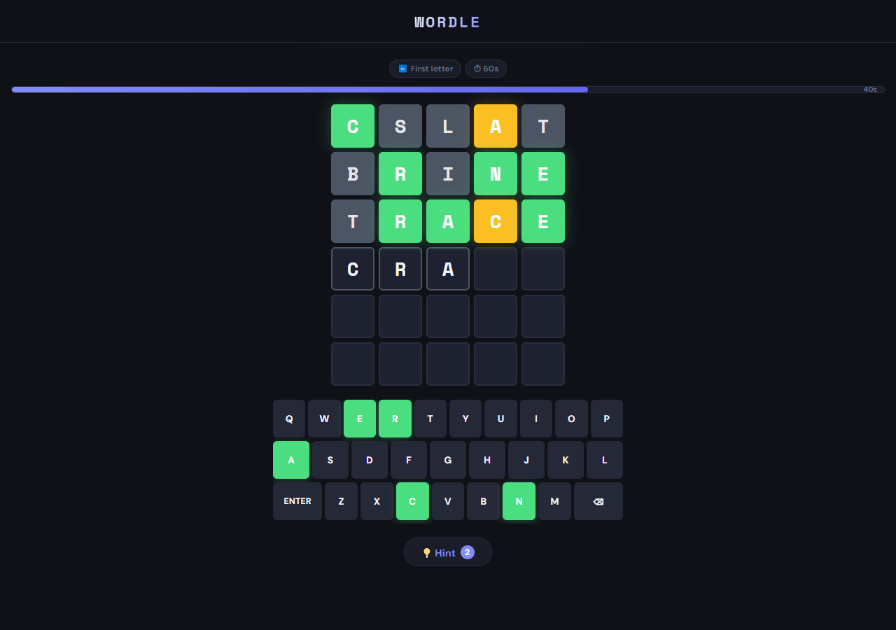
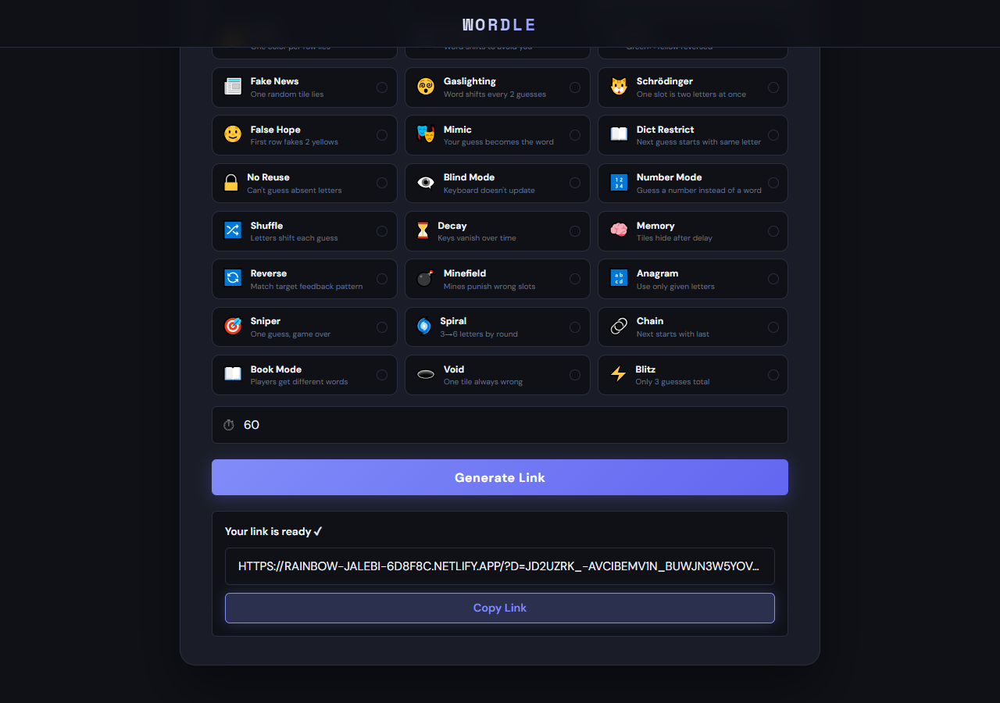
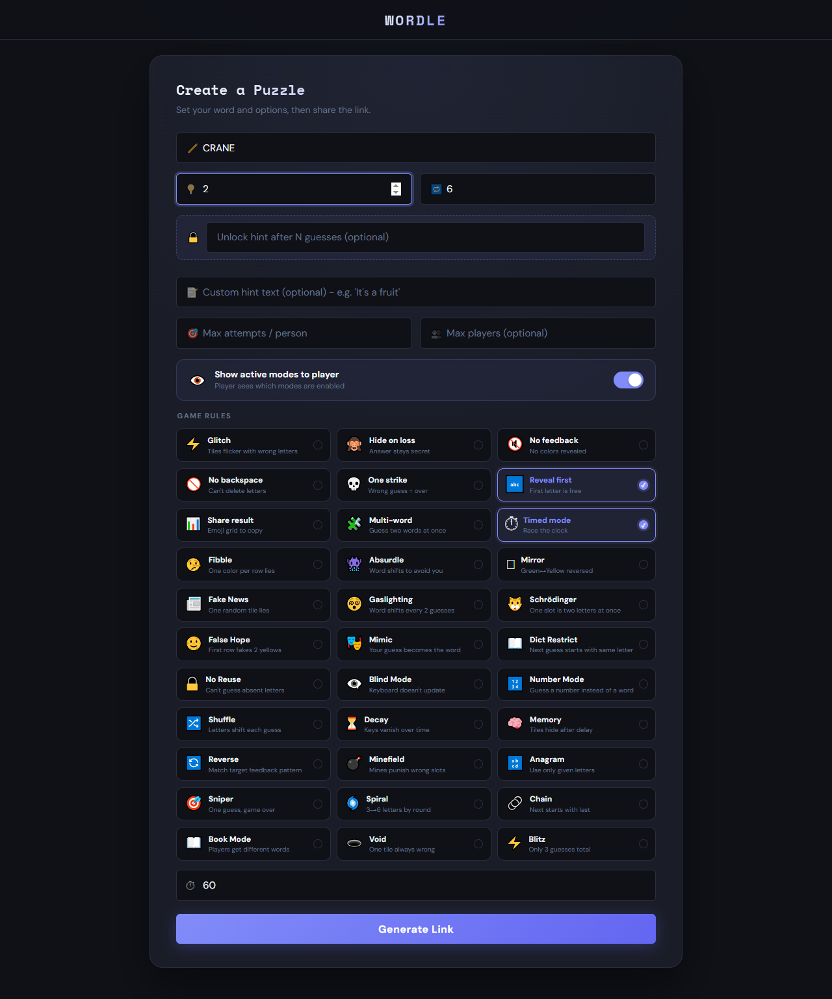

# Custom Wordle

**A Wordle clone with a puzzle creator: pick any secret word, stack up to 33 game modes, and share the puzzle as an encrypted link.**

**Live demo:** https://rainbow-jalebi-6d8f8c.netlify.app/creator.html

<p align="center">
  
  
</p>

<details>
<summary>Full creator page (all 33 modes)</summary>
<p align="center"></p>
</details>

## Highlights

- **Puzzle creator:** choose a 2–15 letter word (or a 1–15 digit number), 1–20 guesses, 0–10 hints, an optional custom hint text and hint unlock after N guesses.
- **33 combinable game modes:** from classic twists (No Backspace, Timed, One Strike) to adversarial ones (Absurdle, Gaslighting, Fibble) and structural ones (Multi-word, Spiral, Book Mode, Number Mode).
- **Encrypted share links:** the puzzle config is packed into a compact binary format and encrypted with AES-128-GCM in the browser. The key material lives in the URL fragment, which is never sent to the server.
- **Play limits enforced server-side:** optional max attempts per person and max concurrent players, tracked by Netlify Functions and Netlify Blobs, with IP rate limiting.
- **No framework:** vanilla JavaScript, HTML and CSS, with the Web Crypto API for encryption.

## How sharing and encryption work

1. The creator generates a random 16-byte **token** (`crypto.getRandomValues`).
2. An AES-128 key is derived from the token with **PBKDF2-SHA-256** (100,000 iterations, fixed app-specific salt).
3. The puzzle config (word, settings, mode flags, Book Mode word pool) is packed into a small byte array and encrypted with **AES-GCM** (random 12-byte IV, 128-bit auth tag).
4. The link has the form `/?d=<iv+ciphertext>#<token>`. The browser never sends the `#fragment` to the server, so the server never sees the word or the key.
5. For play limits, the client sends only a **SHA-256 hash of the token** as the puzzle ID, plus browser fingerprints, to the `play` function.

Old links still work: the client falls back to the pre-PBKDF2 key format and to 8-byte IVs.

> **What this protects and what it doesn't:** the encryption keeps the answer out of the URL in plain text and off the server, and the GCM tag makes edited links fail to decrypt. Anyone who has the full link still holds everything needed to decrypt it in the browser, so it doesn't stop a determined player with DevTools. The production build obfuscates the script to make that harder.

### Attempt and lobby tracking

- **Stable fingerprint:** a hash of browser/device characteristics, designed to be the same in normal and private tabs. It counts attempts per person.
- **Session fingerprint:** the stable fingerprint plus a per-tab `sessionStorage` ID. It counts lobby seats, which expire when a tab stops sending its heartbeat (every 10 s).
- Data is stored in **Netlify Blobs**. IP addresses are masked (`a.b.x.x`) before storage. The `play` function allows up to 30 requests per IP per minute. If the server can't be reached, limited puzzles are blocked (fail closed).

## Game modes

33 modes, grouped into 8 categories. Most can be combined freely.

<details>
<summary><b>Show all modes</b></summary>

#### 🎨 Visual / Feedback

| Mode | Icon | Description |
|------|------|-------------|
| **Glitch** | ⚡ | Tiles randomly flicker with wrong letters |
| **Hide on Loss** | 🙈 | The answer stays secret if you lose |
| **No Feedback** | 🔇 | No colors revealed, pure guessing |
| **Mirror** | 🪞 | Green and yellow feedback are reversed |
| **Blind Mode** | 👁️‍🗨️ | Keyboard doesn't show feedback |

#### ⚙️ Input Restrictions

| Mode | Icon | Description |
|------|------|-------------|
| **No Backspace** | 🚫 | Can't delete letters once typed |
| **No Reuse** | 🔒 | Can't guess letters marked as absent |
| **Reveal First** | 🔤 | First letter is given for free |
| **Dict Restrict** | 📖 | Next guess must start with the same letter as the previous one |
| **Chain** | 🔗 | Each guess must start with the last letter of your previous guess |

#### 💀 Difficulty / Penalty

| Mode | Icon | Description |
|------|------|-------------|
| **One Strike** | 💀 | A wrong guess ends the game immediately |
| **Sniper** | 🎯 | One guess only, so make it count |
| **Blitz** | ⚡ | Only 3 guesses total |
| **Decay** | ⏳ | A keyboard key is permanently disabled every 2 guesses |
| **Minefield** | 💣 | 2 secret mine positions; a wrong letter there costs an extra guess |

#### 🧠 Memory / Hidden Info

| Mode | Icon | Description |
|------|------|-------------|
| **Memory** | 🧠 | Revealed tiles hide after 2 seconds (the keyboard still updates) |
| **Void** | 🕳️ | One tile always shows grey, whatever the real answer is |
| **Fake News** | 📰 | One random tile gives wrong feedback |
| **False Hope** | 🌝 | The first row fakes 2 yellow tiles |

#### 🔀 Word-Changing

| Mode | Icon | Description |
|------|------|-------------|
| **Absurdle** | 👾 | The word shifts to keep as many candidates alive as possible |
| **Gaslighting** | 😵 | The word changes every 2 guesses to maximize confusion |
| **Schrödinger** | 🐱 | One slot contains two letters; either one counts as green |
| **Shuffle** | 🔀 | The secret word's letters swap positions after each guess |

#### 🧩 Special

| Mode | Icon | Description |
|------|------|-------------|
| **Fibble** | 🤥 | One color per row lies about the answer |
| **Mimic** | 🎭 | Your first guess becomes the new secret word |
| **Reverse** | 🔄 | You see the answer; find a guess that produces the target pattern |
| **Anagram** | 🔡 | All letters are revealed scrambled, and you may only use those letters |
| **Spiral** | 🌀 | Rounds of 3 → 4 → 5 → 6 letter words; you must solve all of them |
| **Multi-word** | 🧩 | Guess two words at once; you win by solving both |

#### 📊 Utility / Sharing

| Mode | Icon | Description |
|------|------|-------------|
| **Share Result** | 📊 | Copy an emoji grid of your result to the clipboard after the game |
| **Timed Mode** | ⏱ | Race against a countdown timer (warning state in the last 5 seconds) |
| **Book Mode** | 📚 | The creator sets a pool of 5–30 words; each player gets one at random |

#### 🔢 Numbers

| Mode | Icon | Description |
|------|------|-------------|
| **Number Mode** | 🔢 | Guess a number instead of a word. With Multi-word you get two number boards, or a mixed setup with one letter board and one number board |

</details>

### Mode compatibility

| Rule | Detail |
|------|--------|
| **Spiral** | Single-board and letters only; not compatible with Multi-word or Number Mode |
| **One Strike + Blitz** | One Strike takes priority (1 guess overrides 3) |
| **Mixed mode** | Available when both Multi-word and Number Mode are enabled |
| **Hard modes** | Some hard modes are limited to single-board play |

### Design notes

- **Win detection is mode-safe:** a correct guess ends the game in every mode, including the deceptive ones. In Void Mode, win detection uses the real answer, not the misleading feedback.
- **Reverse Mode:** you win by producing the exact target feedback pattern. Typing the secret word doesn't count as a win.
- **Absurdle and Gaslighting** are adversarial on purpose, so the answer can change mid-game.
- **No Reuse** is a hard rule: guesses that contain known-absent letters are blocked.
- **Chain Mode:** the first guess is free; every guess after that must start with the last letter of the one before.

## Creating a puzzle

1. Open `/creator.html`.
2. Enter your secret word (or number, in Number Mode).
3. Optionally set hints, guesses, hint unlock, custom hint text, max attempts per person and max players.
4. Turn on any game modes. For Book Mode, paste a pool of 5–30 words, one per line.
5. Click **Generate Link** and share it.

In-progress games are saved in `localStorage`, so a player can refresh the page and pick up where they left off.

## Quick start

Requirements: Node.js 18+ and the [Netlify CLI](https://docs.netlify.com/cli/get-started/) (`npm i -g netlify-cli`).

```bash
git clone https://github.com/naniiic137/CustomWordleV2.git
cd CustomWordleV2
npm install
netlify dev        # serves the site and the functions in netlify/functions
```

**Frontend only:** set `var LOCAL_DEV = true;` at the top of `script.js` to skip the serverless calls. Attempt and lobby limits are then simulated in `localStorage`. Set it back to `false` before you deploy.

**Build:** `index.html` and `creator.html` load `script.obf.js`. After you edit `script.js`, regenerate it with:

```bash
npm run build      # javascript-obfuscator: script.js -> script.obf.js
```

You can also point the `<script>` tags at `script.js` while you develop.

## Project structure

```
├── index.html               # Game page (share links open here)
├── creator.html             # Puzzle creator
├── script.js                # All game logic: crypto, config packing, modes, board, keyboard
├── script.obf.js            # Obfuscated build of script.js (the file the pages load)
├── style.css                # Styles
├── netlify.toml             # Publish dir + functions dir
├── package.json             # Build script, @netlify/blobs, javascript-obfuscator
└── netlify/functions/
    ├── play.mjs             # Attempt quota, lobby seats, heartbeat, IP rate limit
    ├── result.mjs           # Records win/loss and guess count for a play
    └── verify.js            # Timing-safe check against the CREATOR_PASSWORD env var
```

## Tech stack

- **Frontend:** vanilla JavaScript, HTML5, CSS3, Web Crypto API (AES-GCM, PBKDF2, SHA-256)
- **Backend:** Netlify Functions (serverless)
- **Storage:** Netlify Blobs
- **Build:** javascript-obfuscator
- **Fonts:** Space Mono, DM Sans (Google Fonts)

It runs in modern browsers that support the Web Crypto API and works on mobile.

## License

© 2026 Hamza Ben Ismail. All rights reserved.

## Credits

Based on the original [Wordle](https://www.nytimes.com/games/wordle/index.html) game by Josh Wardle.
